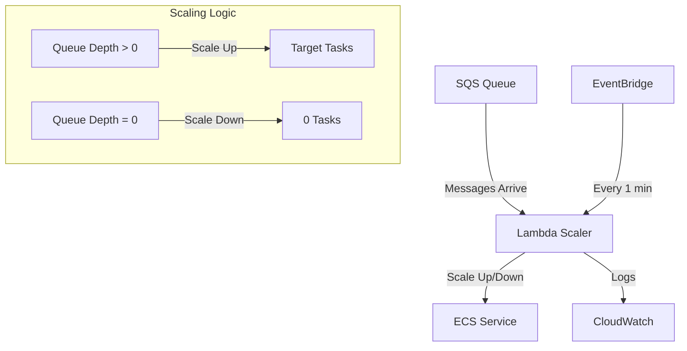

# Serverless ECS Scaler

🚀 **Fast, responsive auto-scaling for AWS ECS services based on SQS queue depth**

Replace slow CloudWatch-based auto-scaling (5-15 minutes) with intelligent Lambda-based scaling (10-30 seconds).

[](https://opensource.org/licenses/MIT)
[](https://www.python.org/downloads/)
[](https://aws.amazon.com/)

## ⚡ The Problem

AWS CloudWatch-based auto-scaling for ECS services has a critical limitation: **it takes 5-15 minutes to respond to changes**. For production systems where users expect sub-minute response times, this creates unacceptable latency and poor user experience.

## 🎯 The Solution

This project provides a **hybrid SQS + EventBridge + Lambda architecture** that delivers:

- ⚡ **Scale-up in 10-30 seconds** (vs. 5-15 minutes with CloudWatch)
- 💰 **True scale-to-zero** with minimal idle costs
- 🔄 **Intelligent monitoring** via dual triggers (SQS + EventBridge)
- 🛠️ **Production-ready** with proper error handling and logging

## 🏗️ Architecture



### How It Works

1. **Immediate Scale-Up**: SQS triggers Lambda when messages arrive → 10-30 second response
2. **Proactive Monitoring**: EventBridge triggers Lambda every minute to check queue depth
3. **Intelligent Scale-Down**: Lambda scales to zero when queue is empty for threshold period
4. **Cost Optimization**: Pay only for actual compute time, no idle costs

## 📦 Quick Start

### Prerequisites

- AWS CLI configured with appropriate permissions
- [Serverless Framework](https://www.serverless.com/framework/docs/getting-started) installed
- Python 3.9+
- An existing ECS cluster and service

### 1. Clone and Install

```bash
git clone https://github.com/yourusername/serverless-ecs-scaler.git
cd serverless-ecs-scaler
npm install -g serverless
npm install serverless-pseudo-parameters
```

### 2. Configure Your Setup

Update the configuration in `serverless.yml`:

```yaml
custom:
  ecsClusterName: 'your-cluster-name'     # Your ECS cluster
  ecsServiceName: 'your-service-name'     # Your ECS service  
  sqsQueueName: 'your-queue-name'         # SQS queue name to create
  scaleUpTarget: '2'                      # Target task count when scaling up
  scaleDownThreshold: '2'                 # Minutes to wait before scaling down
```

### 3. Deploy

```bash
# Deploy to AWS
serverless deploy

# Deploy to specific stage/region
serverless deploy --stage prod --region us-west-2

# Deploy with custom parameters
serverless deploy \
  --cluster my-cluster \
  --service my-service \
  --queue my-job-queue \
  --scale-up-target 3
```

### 4. Test Your Setup

```bash
# Send a test message to trigger scaling
aws sqs send-message \
  --queue-url $(aws sqs get-queue-url --queue-name your-queue-name --output text) \
  --message-body '{"test": "message"}'

# Monitor Lambda logs
serverless logs -f ecsScaler --tail

# Check ECS service status
aws ecs describe-services \
  --cluster your-cluster-name \
  --services your-service-name
```

## 🔧 Configuration Options

### Environment Variables

The Lambda function accepts these environment variables:

| Variable | Required | Default | Description |
|----------|----------|---------|-------------|
| `SQS_QUEUE_URL` | ✅ | - | SQS queue URL to monitor |
| `ECS_CLUSTER_NAME` | ✅ | - | ECS cluster name |
| `ECS_SERVICE_NAME` | ✅ | - | ECS service name to scale |
| `SCALE_UP_TARGET` | ❌ | `1` | Target task count when scaling up |
| `SCALE_DOWN_THRESHOLD` | ❌ | `2` | Minutes to wait before scaling down |

### Serverless Framework Options

Deploy with custom parameters:

```bash
serverless deploy \
  --cluster production-cluster \
  --service video-processor \
  --queue video-jobs \
  --scale-up-target 5 \
  --scale-down-threshold 3 \
  --monitoring-rate "rate(30 seconds)"  # Note: EventBridge minimum is 1 minute
```

## 📊 Performance Characteristics

| Metric | CloudWatch Auto-Scaling | Serverless ECS Scaler |
|--------|------------------------|----------------------|
| **Scale-Up Time** | 5-15 minutes | 10-30 seconds |
| **Scale-Down Time** | 5-15 minutes | 1-2 minutes |
| **Idle Cost** | High (running tasks) | Near-zero (scale-to-zero) |
| **Response Accuracy** | Eventually consistent | Real-time |
| **Setup Complexity** | High | Low (single deployment) |

## 💰 Cost Analysis

### Monthly Costs (Typical Usage)

- **Lambda Invocations**: ~$0.70/month (1 per minute + SQS triggers)
- **EventBridge**: ~$0.01/month
- **SQS**: ~$0.05/month (minimal message volume)
- **CloudWatch Logs**: ~$0.10/month

**Total: ~$0.86/month** vs. paying for idle ECS tasks

### 🎯 **Perfect for GPU Workloads**

This scaler is **especially valuable for GPU instances** that cost hundreds/thousands per month when idle:

- **T4 GPU (g4dn)**: Save $150-200/month
- **A10G GPU (g5)**: Save $300-400/month  
- **V100 GPU (p3)**: Save $600-800/month
- **A100 GPU (p4d)**: Save $3,000-4,000/month

### Cost Savings Example (GPU Instances)

- **Before**: ECS service with GPU instance running 24/7 = $150-4,000/month idle cost
- **After**: Scale-to-zero + scaler costs = $0.86/month
- **Savings**: $149-3,999/month per service

**This is especially valuable for GPU workloads** where idle instances cost hundreds or thousands per month!

## 🧪 Testing

The ECS scaler comes with comprehensive automated testing that validates functionality with real AWS services.

### 🚀 Automated Testing (Recommended)

```bash
# Deploy test infrastructure
./deploy-test.sh deploy

# Run comprehensive automated tests
python automated-test.py

# Clean up when done
./cleanup-test.sh
```

### 🧪 Manual Testing

```bash
# Interactive testing
python test-scaler.py

# Quick verification
aws sqs send-message --queue-url "YOUR_QUEUE_URL" --message-body "test"
aws ecs describe-services --cluster "YOUR_CLUSTER" --services "YOUR_SERVICE"
```

### ✅ What Gets Tested Automatically

- **Scale-Up**: ECS service scales from 0 to 2 tasks when messages arrive
- **Scale-Down**: ECS service scales from 2 to 0 tasks when queue is empty  
- **Performance**: Response times within expected ranges (< 60s scale-up, < 3min scale-down)
- **Integration**: SQS and EventBridge triggers work correctly
- **Error Handling**: Graceful handling of various failure scenarios
- **Load Testing**: Continuous message processing under load

### 🏗️ Test Infrastructure

The automated test setup creates:
- ECS cluster with Fargate capacity
- ECS service (initially scaled to 0)
- SQS queue for job processing
- Lambda function with ECS scaler logic
- VPC with public subnets
- All necessary IAM roles and security groups

### 🔄 CI/CD Integration

GitHub Actions automatically runs tests on every push and pull request:
- Deploys test infrastructure
- Runs comprehensive test suite
- Reports results in PR comments
- Cleans up resources automatically

**See [TESTING.md](TESTING.md) for detailed testing instructions and [IMPLEMENTATION.md](IMPLEMENTATION.md) for quick setup.**

## 🛠️ Examples

### Example 1: Video Processing Pipeline

```yaml
# serverless.yml configuration
custom:
  ecsClusterName: 'video-processing-cluster'
  ecsServiceName: 'video-worker-service'
  sqsQueueName: 'video-processing-jobs'
  scaleUpTarget: '3'  # Handle 3 videos in parallel
  scaleDownThreshold: '5'  # Wait 5 minutes before scaling down
```

### Example 2: Batch Data Processing

```yaml
# serverless.yml configuration  
custom:
  ecsClusterName: 'data-processing-cluster'
  ecsServiceName: 'batch-processor-service'
  sqsQueueName: 'batch-processing-jobs'
  scaleUpTarget: '10'  # High concurrency for batch jobs
  scaleDownThreshold: '1'  # Aggressive scale-down
```

### Example 3: Development Environment

```yaml
# serverless.yml configuration
custom:
  ecsClusterName: 'dev-cluster'
  ecsServiceName: 'dev-worker-service'
  sqsQueueName: 'dev-jobs'
  scaleUpTarget: '1'  # Single task for development
  scaleDownThreshold: '1'  # Immediate scale-down
```

## 🔍 Monitoring and Troubleshooting

### CloudWatch Metrics

The scaler automatically logs these metrics:

- Queue depth at each invocation
- Current ECS task count
- Scaling actions taken
- Trigger source (SQS vs EventBridge)

### Common Issues

#### 1. Service Not Scaling Up

**Symptoms**: Messages in queue but ECS service remains at 0 tasks

**Solutions**:
```bash
# Check Lambda permissions
aws iam get-role-policy --role-name serverless-ecs-scaler-dev-us-east-1-lambdaRole --policy-name dev-serverless-ecs-scaler-lambda

# Check Lambda logs
serverless logs -f ecsScaler --startTime 5m

# Verify SQS trigger is configured
aws lambda list-event-source-mappings --function-name serverless-ecs-scaler-dev-scaler
```

#### 2. Service Not Scaling Down

**Symptoms**: ECS service remains at target count even when queue is empty

**Solutions**:
```bash
# Check EventBridge rule status
aws events describe-rule --name serverless-ecs-scaler-dev-ecsScaler-schedule

# Verify EventBridge is triggering Lambda
aws logs filter-log-events \
  --log-group-name /aws/lambda/serverless-ecs-scaler-dev-scaler \
  --filter-pattern "eventbridge"
```

#### 3. Permission Errors

**Symptoms**: Lambda fails with `AccessDenied` errors

**Solutions**:
```bash
# Check ECS permissions
aws ecs describe-services --cluster your-cluster --services your-service

# Update IAM role if needed
serverless deploy  # Redeploy to update permissions
```

### Debug Mode

Enable detailed logging by updating the Lambda environment:

```bash
# Add debug logging
serverless deploy --param="logLevel=DEBUG"
```

## 🧪 Testing

### Unit Tests

```bash
cd tests
python -m pytest test_scaler.py -v
```

### Integration Tests

```bash
# Deploy to test environment
serverless deploy --stage test

# Run integration tests
python tests/test_integration.py

# Clean up
serverless remove --stage test
```

### Load Testing

```bash
# Send multiple test messages
for i in {1..10}; do
  aws sqs send-message \
    --queue-url $(aws sqs get-queue-url --queue-name your-queue-name --output text) \
    --message-body "{\"job\": $i}"
done

# Monitor scaling behavior
watch -n 5 'aws ecs describe-services --cluster your-cluster --services your-service --query "services[0].runningCount"'
```

## 🤝 Contributing

We welcome contributions! Please see our [Contributing Guide](CONTRIBUTING.md) for details.

### Development Setup

```bash
git clone https://github.com/yourusername/serverless-ecs-scaler.git
cd serverless-ecs-scaler

# Install development dependencies
pip install -r requirements-dev.txt

# Run pre-commit hooks
pre-commit install

# Run tests
pytest
```

## 📄 License

This project is licensed under the MIT License - see the [LICENSE](LICENSE) file for details.

## 🙏 Acknowledgments

- Inspired by the need for faster auto-scaling in production video processing pipelines
- Built on the AWS Serverless ecosystem
- Community feedback and contributions

## 📞 Support

- 🐛 **Bug Reports**: [GitHub Issues](https://github.com/yourusername/serverless-ecs-scaler/issues)
- 💡 **Feature Requests**: [GitHub Discussions](https://github.com/yourusername/serverless-ecs-scaler/discussions)
- 📧 **Email**: support@yourproject.com

---

**⭐ If this project helps you, please star it on GitHub!**

